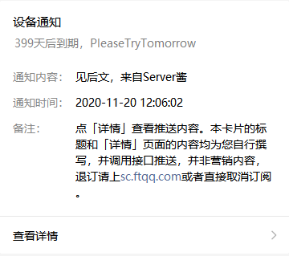
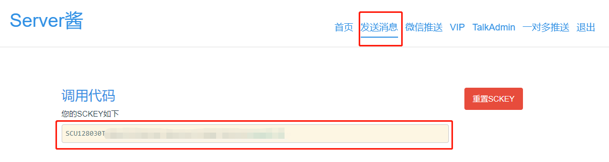
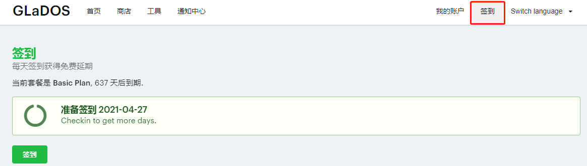
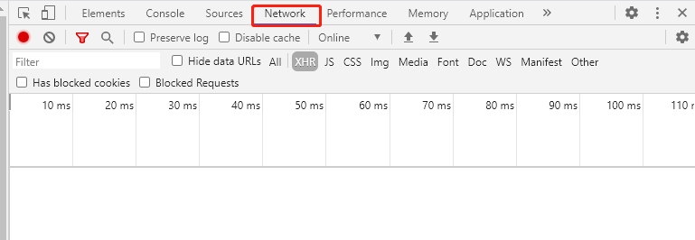
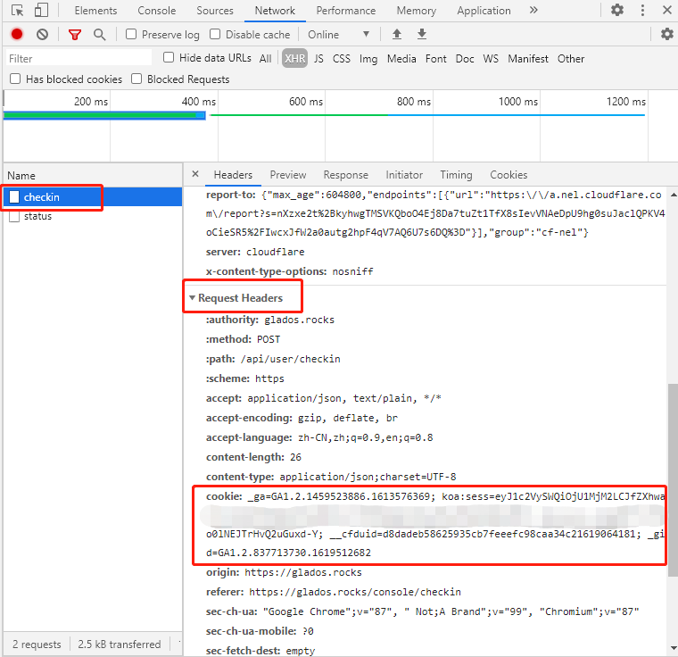
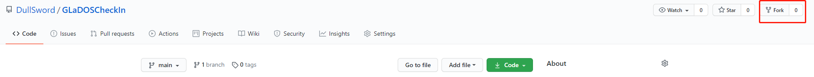
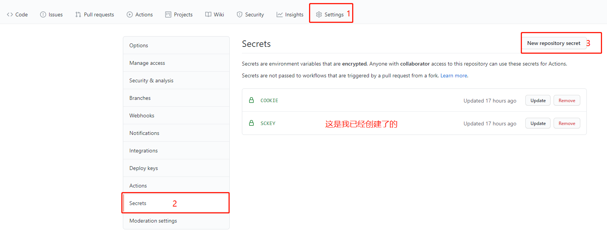
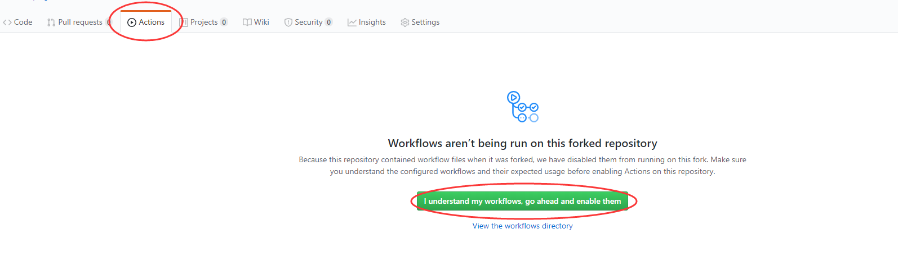
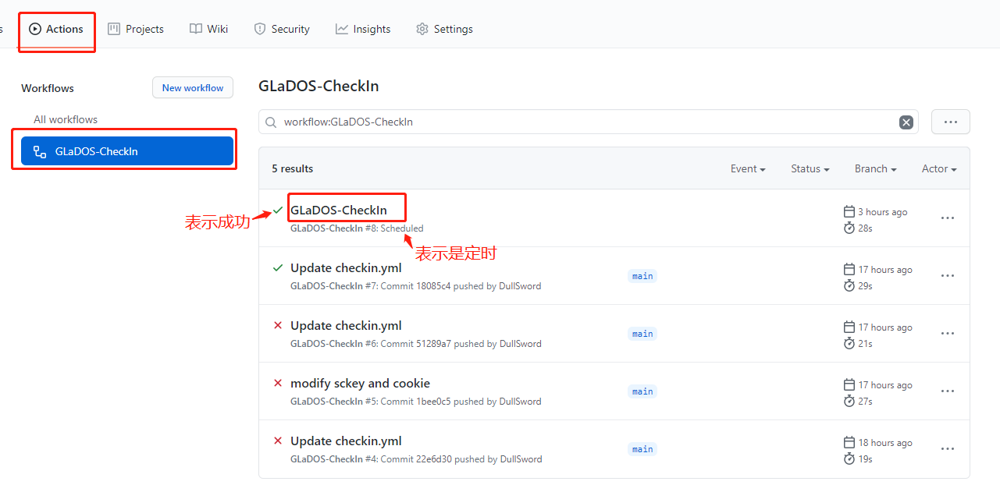
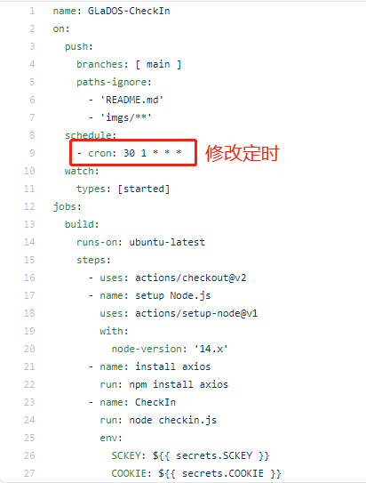

# GLaDOS 每日签到💮

- 基于 [Github Actions](https://github.com/features/actions)
- 每天北京时间 **9点30分**（[UTC时间](https://datetime360.com/cn/utc-beijing-time/) 1点30分）进行自动签到
    - 实际上通常会延迟，但不会太久，庆幸的是大多情况下我们并不关心是否准时
- 可用 [Server酱](https://sc.ftqq.com/) 通过公众号推送结果
  
  

- [Discuss on GitHub](https://github.com/DullSword/GLaDOS-CheckIn/discussions)

## GLaDOS

>GLaDOS为用户提供最快速，稳定和安全的端点，使他们充满信心地访问高速国际互联网、Netflix和隐私。

我只用来冲冲浪🏄，到目前为止，感觉挺不错的，而且它有说对教育免费开放的，这一点让我觉得很良心，不过我并没享受到🍋。

[GLaDOS 项目地址](https://github.com/glados-network/GLaDOS)

[GLaDOS 注册教程](https://dullsword.github.io/2020/11/26/GLaDOS-%E6%B3%A8%E5%86%8C%E6%95%99%E7%A8%8B/)

## 代码说明💻

[Github Actions GLaDOS自动签到](https://dullsword.github.io/2020/11/20/Github-Actions-GLaDOS%E8%87%AA%E5%8A%A8%E7%AD%BE%E5%88%B0/)

## 使用说明💡

### 一、准备工作📝

- Serve酱的 SCKEY（不需要可以跳过）

- 账号的 cookie（并非仅此单一获取方式）
    1. 打开 GLaDos 并登陆，找到右上角 "签到" 跳转到签到页面
    
    
    
    2. 打开 "开发者工具"，通常快捷键为 F12，或是点击 浏览器选项 > 更多工具 > 开发者工具，打开后如图所示点击 "network" 标签
   
    
    
    3. 在签到页面点击签到，相对应的开发者工具 network 标签下会出现 "checkin" 请求，点击该请求，会出现更多信息，找到 "Request Headers" 里的 "cookie"，接下来设置密钥时需要用到
    
    

### 二、Fork此仓库🍴

**注意：接下来的步骤都是在你自己fork后的仓库下进行操作**

### 三、设置密钥🔑

- SCKEY：serve酱的 sckey（不需要可以不创建或不设置）

- COOKIE：账号的 cookie（第一步准备工作中所找到的 cookie）

**注意：密钥名 SCKEY 和 COOKIE，两者的所有字母都是大写**

### 四、启用Action🖱

1. 点击 Actions，再点击 "I understand my workflows, go ahead and enable them"

2. 点击仓库（你自己的）右上角的Star⭐

### 五、查看运行结果🔎

## 修改定时🕤

1. 打开 [.github/workflows/checkin.yml](https://github.com/DullSword/GLaDOS-CheckIn/blob/main/.github/workflows/checkin.yml)
2. 修改 [crontab](https://zh.wikipedia.org/wiki/Cron) 表达式

## Star⭐

**觉得还不错的话，可以给我点一下Star⭐**

